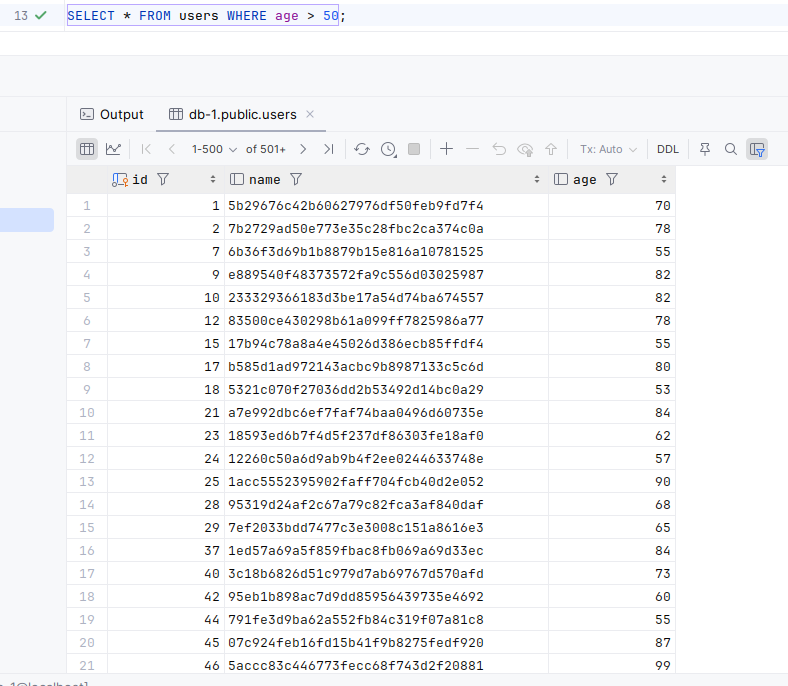
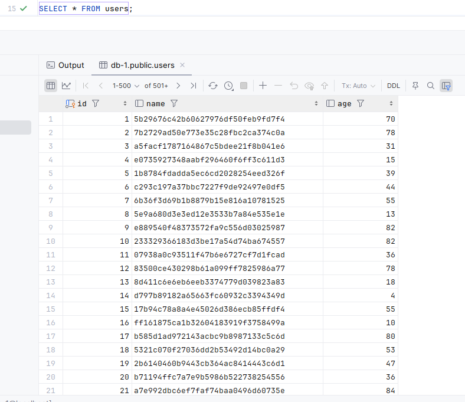
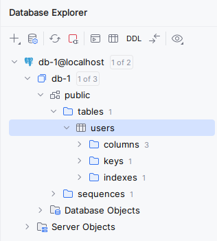
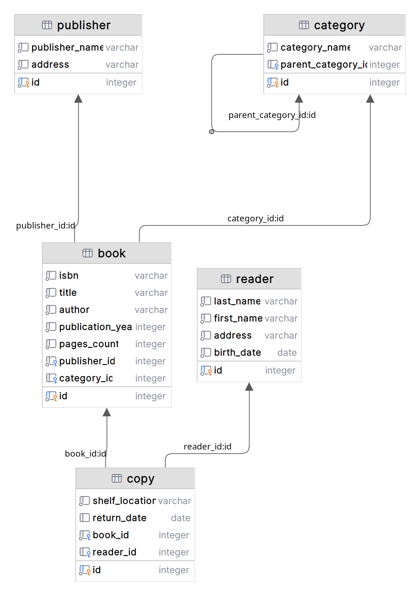
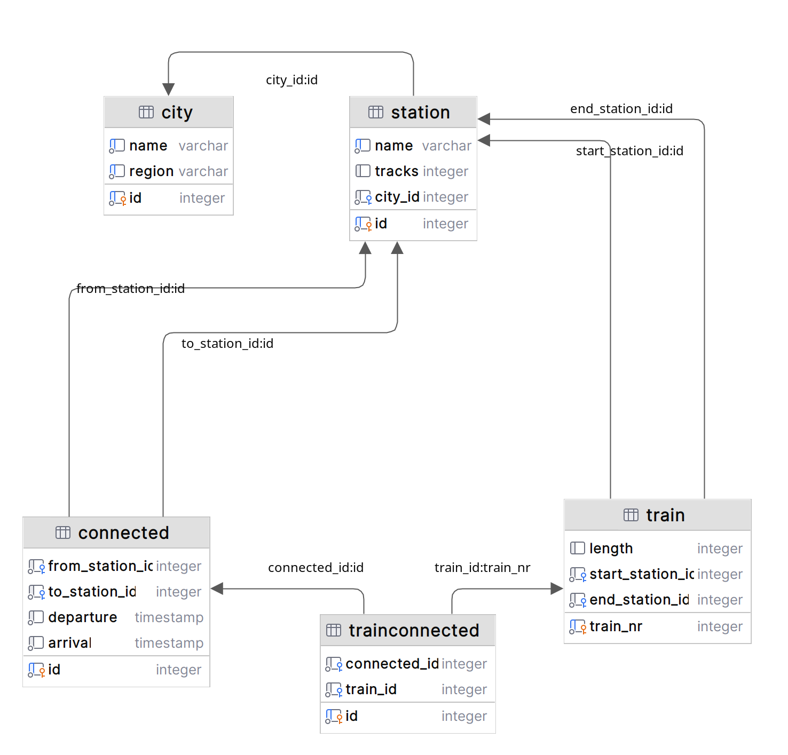
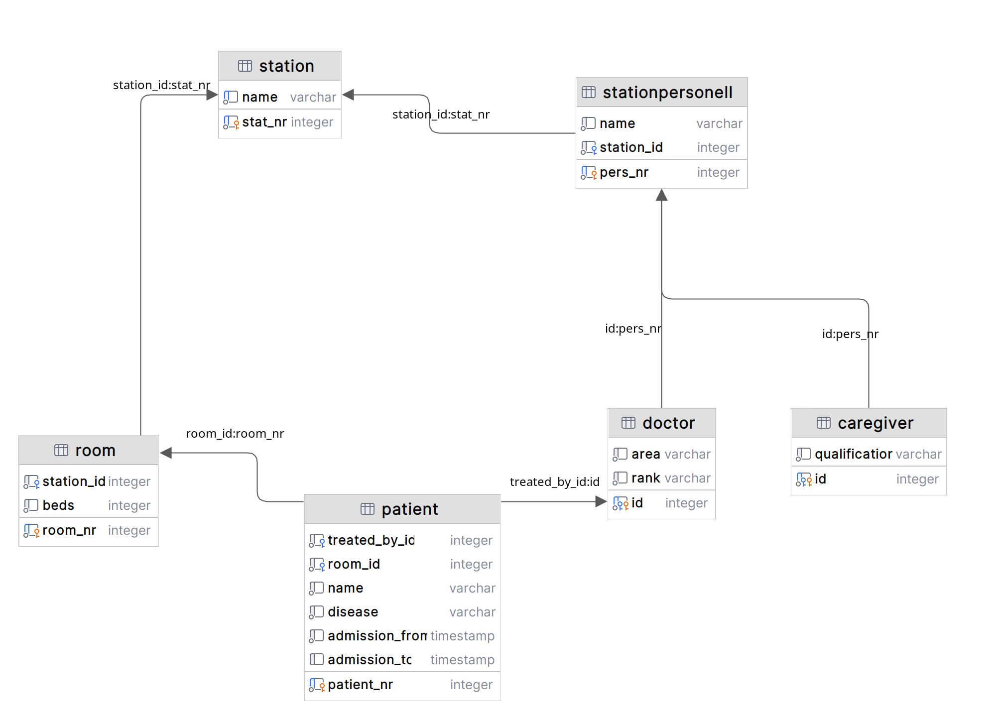

# Task04 - Дадыков Артемий, БПИ225

- [Репозиторий с условием домашнего задания](https://github.com/nemirlev/db_less_4).

# I. Выполнение задания согласно README

# Самостоятельное выполнение

## Создается docker-compose.yml с двумя сервисами: PostgreSQL

```yaml
version: "3"
services:
  postgres-1:
    image: postgres:alpine
    container_name: pg-1
    environment:
      POSTGRES_USER: postgres
      POSTGRES_PASSWORD: hack_me
      POSTGRES_DB: db-1
    ports:
      - "5432:5432"
    volumes:
      - pgdata1:/var/lib/postgresql/data

  postgres-2:
    image: postgres:alpine
    container_name: pg-2
    environment:
      POSTGRES_USER: postgres
      POSTGRES_PASSWORD: hack_me
      POSTGRES_DB: db-2
    ports:
      - "5433:5432"
    volumes:
      - pgdata2:/var/lib/postgresql/data

volumes:
  pgdata1:
  pgdata2:
```

## Загрузите туда данные

```
docker compose up -d
[+] Running 4/4
 ✔ Volume "pgdata2"  Created   0.0s 
 ✔ Volume "pgdata1"  Created   0.0s 
 ✔ Container pg-2                   Started   0.0s 
 ✔ Container pg-1                   Started   0.0s
```

## Подключитесь к базе данных через DataGrip


## Выполните тестовые SQL-запросы

```
[2024-10-01 12:26:32] Connected
db-1.public> CREATE TABLE users (
                 id SERIAL PRIMARY KEY,
                 name VARCHAR(100),
                 age INT
             )

[2024-10-01 12:26:32] completed in 10 ms
db-1.public> INSERT INTO users (name, age)
             SELECT
                 md5(random()::text),
                 floor(random() * 100)
             FROM generate_series(1, 10000)

[2024-10-01 12:29:10] 10,000 rows affected in 45 ms
db-1.public> SELECT * FROM users WHERE age > 50

[2024-10-01 12:29:16] 500 rows retrieved starting from 1 in 325 ms (execution: 8 ms, fetching: 317 ms)
db-1.public> SELECT * FROM users

[2024-10-01 12:29:27] 500 rows retrieved starting from 1 in 46 ms (execution: 4 ms, fetching: 42 ms)
```

### Результат выполнения первого тестового `SELECT`а



### Результат выполнения второго тестового `SELECT`а



## Удалите контейнеры

```
docker compose down
[+] Running 3/3
 ✔ Container pg-2                  Removed                                                                                                                                                                                                                     0.2s 
 ✔ Container pg-1                  Removed                                                                                                                                                                                                                     0.2s 
 ✔ Network project_default         Removed 
```

## Сделайте скриншоты и опишите результаты

> Контейнеров больше нет, т.е. взаимодействие с БД нет.

```
docker ps
CONTAINER ID   IMAGE     COMMAND   CREATED   STATUS    PORTS     NAMES
```

## Запустите контейнеры снова и проверьте, что данные остались или нет

> Запустим через `docker compose up -d` и подключимся через DataGrip.




> Данные сохранились. Ура! 🥳

## Сделайте скриншоты и опишите результаты

> Данные сохранились благодаря хранению на диске через `volume`. 😎

# II. Физические диаграммы из прошлого задания запустить в БД в Docker

> Всё получилось: sql-скрипты находятся в папке sql.

## Первая диаграмма (библиотека)



## Вторая диаграмма (поезда)



## Третья диаграмма (врачи-пациенты)


